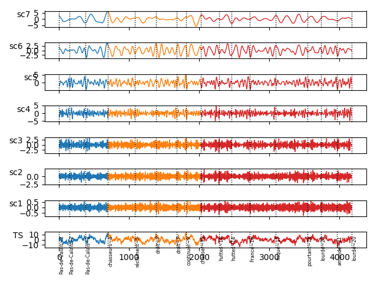

# synchronized-eeg-analysis (sea): EM-synchronized EEG analysis wrapping MODWT R package waveslim 

## :warning: the package is now obsolete and has been ported to R

## Installation

```bash
git clone https://github.com/PyENE/synchronized-eeg-analysis.git
cd synchronized-eeg-analysis
sudo python setup.py install --user
```
## Download EM .xls data
```bash
wget xxx
```
## Download EEG .mat data

```bash
wget yyy
```

## Usage

```python
import os
import pandas as pd
from sea.config import DATA_PATH
from sea import MODWT
from sea import SynchronizedEEG
import scipy.io

eeg_data = scipy.io.loadmat(os.path.join(DATA_PATH, 's01_sample.mat'),
                            squeeze_me=True, struct_as_record=False)['EEG']
em_data = pd.read_csv(os.path.join(DATA_PATH, 's01_sample.csv'))
se = SynchronizedEEG(eeg_data, em_data, 's01', 'chasse_oiseaux-f1')
ts = se.eeg_trial[0, :]
tmin = se.get_first_fixation_time_id()
tmax = se.get_last_fixation_time_id()
margin = - se.eeg_times[0]
phases = se.compute_epoch_phases(from_zero=True, tmax=se.get_last_fixation_time())
wt = MODWT(ts, tmin=tmin, tmax=tmax, margin=margin, nlevels=7, wf='la8')
fixations_time = se.get_fixations_time(from_zero=True)
tags = se.get_fixed_words()
wt.plot_time_series_and_wavelet_transform_with_phases(phases, events=fixations_time, tags=tags)
```


